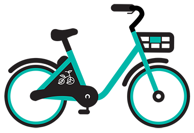

# BikeShare Project
*Date Created: 24 Dec 2021*

## Overview
The BikeShare Project is a comprehensive data exploration tool designed to analyze bikeshare services in three major US cities: Chicago, Washington D.C., and New York City. By utilizing this tool, users can gain insights into popular trips, the most frequented start and end stations, travel times, and other valuable information to better understand bikeshare usage patterns and trends.

## Data
The project leverages bikeshare data provided in CSV format for the following cities:
- Chicago
- Washington D.C.
- New York City

## Features
- Interactive user interface for easy data exploration
- Customizable data filtering options by city, date, and time
- Analysis of popular trips, including the most common start and end stations
- Calculation of key statistics, such as average trip duration and user demographics

## Dependencies
- Pandas for data manipulation and analysis
- NumPy for numerical operations

## Acknowledgments
- Udacity Advance Scholarship team for providing the necessary training and resources to build this project
- StackOverflow community for valuable support and guidance
- Pandas documentation for in-depth information on data handling techniques
- Access Bank Nigeria for their contributions and support
